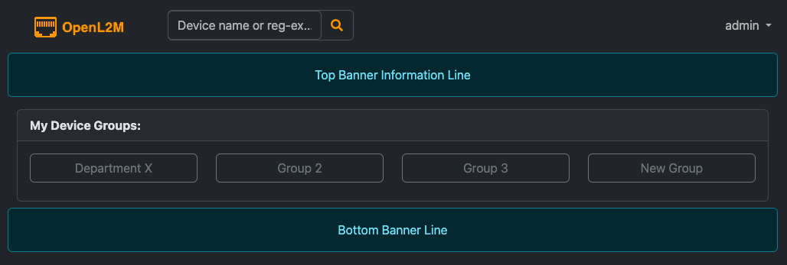
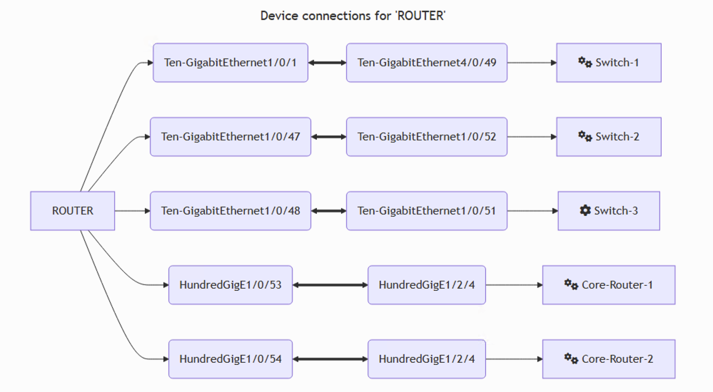

__OpenL2M, Open Layer 2 Management__, is an open source network device management
application designed to allow users with minimal training to perform a set of basic
configuration changes on network devices, with a focus on port or interface (i.e Layer 2) changes.
It does so by providing a consistent web interface and API
for device management, independent of the underlying switch vendor.

OpenL2M attempts to address the needs of distributed IT groups managing parts
of a shared distributed layer 2 ("switching") network.

While primarily intended to manage network switches, OpenL2M can handle any device that has some
sort of network API (e.g. SSH, Netconf, REST, etc.)

__For Quick Testing:__ download the __Docker Compose__ test config at https://github.com/openl2m/docker-test

__Features:__

* Light or Dark theme.
* enable/disable interface, or PoE state
* change vlan or description on interface
* see ethernet addresses, lldp neighbors, and download to spreadsheet or graph
* on routers, show IPv4/v6 interface info, and IPv4 ARP and IPv6 ND (Neighbor Discovery) information.
* add, edit or delete vlans on devices
* show interface MPLS VRF membership on supported devices
* run configurable pre-defined 'static' and 'form input' commands on the device
* show optical transceiver info
* vendor-agnostic REST API. Automate changes from scripts, etc.
* pluggable backend to support new vendor devices, allowing easy development
* and more...

__Devices Supported:__

In alphabetical order:

* Arista devices (via SNMP)
* Cisco switches (Catalyst, CBS, via SNMP)
* Aruba AOS-CX switches (REST API(preferred), or SNMP)
* HP/Aruba Procurve switches (via SNMP)
* HPE Comware switches (via SNMP)
* Juniper "ELS" devices (via Junos PyEz API, or R/O via SNMP)
* Netgear (newer)
* Generic SNMP devices
* Any device supported by the Netmiko library (see SSH devices)
* Most devices supported by Napalm (read-only)

See the documentation for more information about device compatibility and specific devices tested.

__What's New:__

Highlights:

v3.4 adds support for IPv6 ND and interface IPv6 info. Also supports Cisco CBS devices. And we can graph neighbor devices.

v3.3 adds support Arista Network devices via SNMP. Also shows info in MPLS VRFs and member interfaces on supported devices, read from the standard MPLS SNMP Mib. SNMP now supports authencation up to SHA-512 and privacy up to AES-256. Django is upgraded to v5.1 and we now support Python v3.12

v3.2 adds a Dark Theme. It improves web accessibility and provides a more modern look, and more consistent layout through the use of Bootstrap 5.3. A docker compose config for developing is provided.

v3.1 upgrades to Django 5.0, and adds a docker-compose config for quickly testing OpenL2M in a container.

v3.0 adds a vendor-agnostic REST API for remote scripting and automation.

v2.4 adds vlan add/edit/delete for all supported devices, and upgrades the Django framework to v4.2 LTS

v2.3 adds support for Juniper Junos devices.

v2.2 adds support for Aruba AOS-CX switches.

v2.1 implements command templates, a controlled method to give users variable input on commands.
This gives tremendous flexibility in giving users in a controlled fashion more visibility into the device.
See the Configuration section for more.

v2.0 implements a new plug-in API that will allow for easy add-on drivers.
This makes is easy to add support for any kind of network device,
whether the interface is SSH, REST, NetConf, or other methods.
See the documentation for more information. We now support Aruba AOS-CX and Juniper devices
through custom drivers.

__Why OpenL2M__:

OpenL2M was developed in an attempt to learn
Django, and in the hope that it may some day provide a possibly useful
application for distributed "basic" network switch management.
It is developed to address the needs of distributed IT groups managing parts
of a distributed layer 2 ("switching") network.

__Requirements__:

This is minimal list of requirements. Read the documentation for more details.

* a Linux OS environment able to run nginx.
* Python v3.10 - v3.12 (v3.13 is not yet supported)
* Postgres version 13 or higher.
* NetSNMP packages on your Linux server, and ability to install and run python EzSNMP package.

__License__:

OpenL2M is free software: you can redistribute it and/or modify it
under the terms of the GNU General Public License version 3 as published by
the Free Software Foundation.

OpenL2M includes software from third parties, which are either licensed under
the GPL or compatible licenses.
See individual source files for more detailed copyright notices.

This program is distributed in the hope that it will be useful, but WITHOUT
ANY WARRANTY; without even the implied warranty of MERCHANTABILITY or
FITNESS FOR A PARTICULAR PURPOSE. See the GNU General Public License for
more details.  You should have received a copy of the GNU General Public
License along with OpenL2M. If not, see <http://www.gnu.org/licenses/>.

__Documentation__:

See the following OpenL2M documentation:

* at https://openl2m.readthedocs.io/
* after install, from the application menu, or at <your-website-url>/static/docs/html/
* in the ./docs/ source folder (in RST format, buildable with Sphinx, e.g. run 'make html'.
  This will build in ./django/project-static/docs/html/

__Screenshots__:

__Login Window:__ Shows configurable login, top and bottom banners.

<kbd></kbd>

__Devices Menu:__ Shows the groups and devices you can access

<kbd></kbd>

__Dark Mode Devices Menu:__ Dark Mode view of the groups and devices you can access

<kbd></kbd>

__Interfaces Menu:__ Edit a single interface at a time

<kbd></kbd>

__Bulk-Edit Menu:__ Edit multiple interfaces at once

<kbd></kbd>

__Commands Menu:__ Run pre-defined commands on the device

<kbd></kbd>

__Command Templates Menu:__ Run pre-defined commands with user-input on the device

<kbd></kbd>

__VLAN Edit Menu:__ Add, Rename, or Delete vlans

<kbd></kbd>

__Device Connections Graph:__

<kbd></kbd>

__Downloads__:

OpenL2M sources can be found at
<https://github.com/openl2m/openl2m>

Enjoy!
