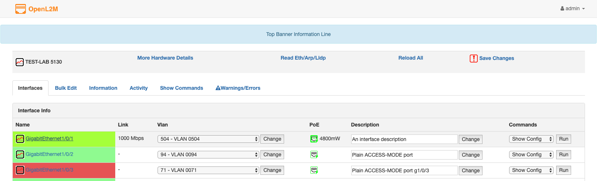
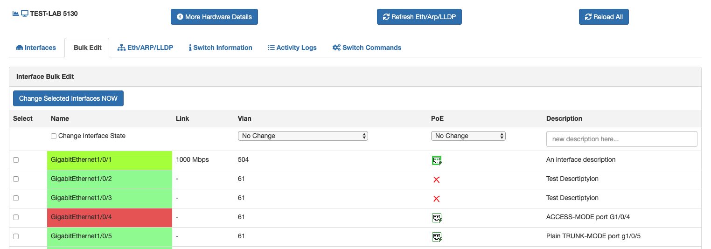

__OpenL2M, Open Layer 2 Management__, is an open source switch management
application designed to provide a consistent web interface for Layer 2 device
management, independent of the underlying switch vendor.  

OpenL2M was developed in an attempt to learn
Django, and in the hope that it may some day provide a possibly useful
application for distributed "basic" network switch management.
It is developed to address the needs of distributed IT groups managing parts
of a distributed layer 2 ("switching") network.

__License__: OpenL2M is free software: you can redistribute it and/or modify it
under the terms of the GNU General Public License version 3 as published by
the Free Software Foundation.

OpenL2M includes software from third parties, which are either licensed under
the GPL or compatible licenses.
See individual source files for more detailed copyright notices.

This program is distributed in the hope that it will be useful, but WITHOUT
ANY WARRANTY; without even the implied warranty of MERCHANTABILITY or
FITNESS FOR A PARTICULAR PURPOSE. See the GNU General Public License for
more details.  You should have received a copy of the GNU General Public
License along with OpenL2M. If not, see <http://www.gnu.org/licenses/>.

__Documentation__: See the following OpenL2M documentation:

* in the ./docs/ folder (in RST format, buildable with Sphinx, e.g. run 'make html'.
  This will build in ./django/project-static/docs/html/
* after install, from the menu, or at <your-website-url>/static/docs/html/
* at https://openl2m.readthedocs.io/

__Screenshots__:

Interfaces Menu:

BulkEdit Menu:

__Download__:

OpenL2M sources can be found at
<https://github.com/openl2m/openl2m>

Enjoy!
