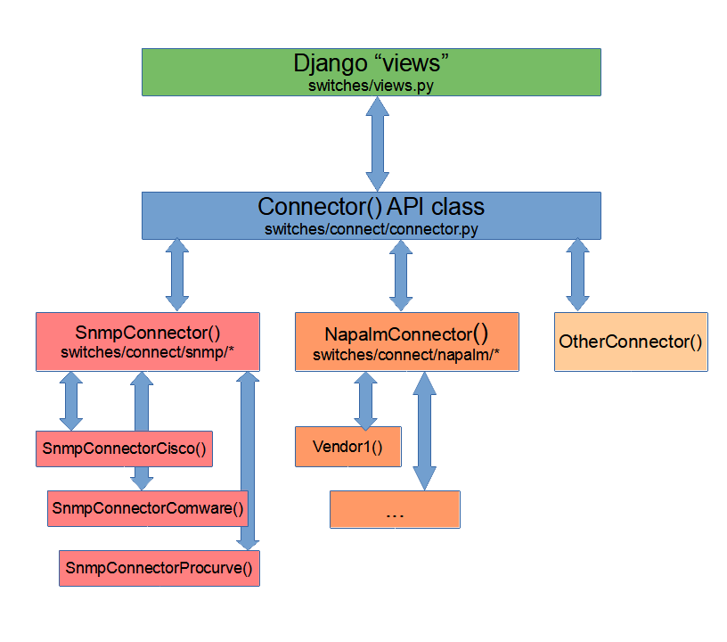

.. image:: ../../_static/openl2m_logo.png

======================
The Connector() Object
======================

Switch connections are made via the **Connector() class**. The Django "views" in
*switches/views.py* instantiate an object derived from this Connector() class.

Collecting data from the device/switch is done by calling functions of the Connector() class.

Depending on the "view", *switch/views.py* calls *def switch_view()* with parameters. This function opens the connection (see below),
and then calls *Connector().get_basic_info()*. If the view is 'arp/lldp', we also run *Connector().get_client_data()*

The Connector() class
=====================

connect.py
----------

**get_connection_object()** figures out what specific Connector() class to get
for the device. This is based on the Switch() device configuration in the admin pages.
It returns the proper object. It is called by all 'views.py' functions
to get an object for the current device/switch.

It should be called as:

.. code-block:: python

  try:
        conn = get_connection_object(request, group, switch)
    except Exception:
        # handle exception as needed

connector.py
------------

The Connector() class is defined in *switches/connect/connector.py*. This *Connector()* base class
is inherited by all device- or vendor-specific connectors.

Basic Info Collection
---------------------

Interface information is learned by calling *Connector().get_basic_info()*. If exists, this calls *self.get_my_basic_info()*,
which is a vendor driver specific implementation.

Next, it runs *self.get_my_hardware_details()*, again a vendor implementation that can be implemented read a variety of hardware
information. Data can be added to the "Device Info" tab by calling the *self.add_more_info()* function.

Next, we see if the driver has VRF support, by calling *self.get_my_vrfs()* if that function exists. This can implement protocol
or vendor-specific VRF data being collected. (E.g. SNMP VRF mibs are read by the default SnmpConnector() class)

Finally, we run *self.check_device_health()* to check a variety of 'health related' items based on the data collected so far.
This checks some generic data, and then calls *self.check_my_device_health()* for vendor-specific data.

**get_my_basic_info()**

This is called when a switch is selected from the menu,
and is called from the corresponding Django view.
This function should load the necessary information about interfaces
to produce the basic switch view.

More especially, this should load:

* the connector.vlans{} dictionary with Vlan() objects.
* the connector.interfaces{} dictionary with Interface() objects, each one representing an
  interface on the device.

Note that these supporting classes (objects) are defined in *switches/connect/classes.py*

A good example is in *switches/connect/snmp/connector.py*, where *get_my_basic_info()*
uses snmp to get information on interfaces, vlans, lacp info, PoE, and more.

**IMPORTANT DATA TYPES:**

There are several Python dictionaries used to store data. Several of these have specific key data type requirements.
They are:

* *self.vlans*: the key (index) is an *integer (int)* representing the numeric vlan ID. Items are Vlan() class instances.

* *self.interfaces*: this key (index) is a *string (str)*, representing a driver-specific key (frequently the name or snmp interface index, aka ifIndex)
  Items are Interface() class instances.

* *interface.port_id*: this is an *integer (int)* representing the switch port ID. This comes into play with SNMP drivers,
  as only physical interfaces have port id's, and the interface index and the switchport ID can be different.
  For more details, read the SNMP driver explanations.

**_can_manage_interface(iface)**

The connector() class has some rules about what interfaces can be managed. This is based on user rights (admin, staff, regular),
group vlan access, etc.

Additionally, drivers can provide rules for their interfaces by implementing **self.__can_manage_interface(iface=Interface())**.

This functions is called from the base class. If it returns False, all interface permissions are disabled.
In the function call, the drivers can set the attribute *iface.unmanage_reason* to a string indicating
why this interface cannot be managed.

**get_my_hardware_details()**

Optionally, this may be implemented by a driver to fill on more details
about the device, such as serial number, model,etc. Most drivers do implemented this.
If this function exists, it is also called from the 'view' function, like 'get_my_basic_info()'.

Note that admins can disable this functionality to save device reading time. You can unchecking the setting
in the Group or Switch entry in the admin pages. It can also be globally disabled by editing configuration.py
and restarting the OpenL2M service.

**check_my_device_health()**

This is will be called to perform a health check on the device. In Connector(), there is *check_device_health()* that checks
a few 'warnings' related to PoE. Each vendor driver can implement *check_my_device_health()* as needed.

Drivers can implement this function to check device health and provide information to the user.
E.g. This can be used to check stack health, power-supplies or whatever. There is a log message
for device health.

.. note::

    This functionality is NOT meant to provide full-blown device status monitoring! That is best provide by an NMS.

    Use this to implement check on states that are not normally found by NMS systems,
    such as stacking problems (unexpected device as 'main' unit), PoE Faults, etc.

Here is a example of skeleton code:

.. code-block:: python

  def check_my_device_health(self):

    # do your own vendor/device specific checking...

    # you can add information to the device-info tab
    self.add_more_info(category="Category", name="Attribute", value="Value")

    # or add a warning to the web ui:
    self.add_warning(warning="The Fan is BAD", add_log=False)

    # then add a log message
    self.add_log(description="The Fan is BAD", type=LOG_TYPE_WARNING, action=LOG_HEALTH_MESSAGE)

    return

Arp/lldp Collection
-------------------

For the ARP/LLDP view, we call *self.get_client_data()*. This will call *self.get_my_client_data()*
if the driver-specific implementation exists.

**get_my_client_data()**

If implemented, this is called when the user clicks the related button(ARP/LLDP) when the device is shown.
Is it called to load information about the known ethernet addresses, arp tables, lldp neighbors,
and more. It should load additional data structures of the Connection() object. See the specific pages
describing these data structures in more detail.

A good example is in *switches/connect/snmp/connector.py*, where *get_my_client_data()* uses snmp
to get information on switch tables (ethernet addresses), arp tables and neighbor devices via lldp.

run_command() and run_command_string()
--------------------------------------

These functions are used to run CLI commands. *Connector.run_command()* is used for static commands,
and form template input commands are handled by *Connector().run_command_string()*.

Both call *self._execute_command()* to execute the resulting SSH command string.

See :doc:`SSH Connections<netmiko/index>` for more details.

Data Caching
------------

The current device is cached in the HTTP session cache. After the Connector() object is instantiated,
switch data is read with *get_basic_switch_info()*. Various list, dictionaries and regular
variables are stored in the Connection() object, and are cached
at the end of processing of the Django 'view' call with **Connector().save_cache()**

On subsequent page views, there is a check for the current device in the *get_connection_object()*
call. If still the same, any existing cache is read by calling *Connector().load_cache()*.

**save_cache()** and **load_cache()** use the HTTP request object session to store and read the cached data.
This defaults to storing in the database, but can be configured via the standard Django session configuration.

Finally, view pages can go on with their work.

