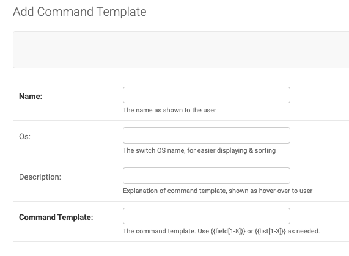
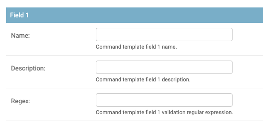
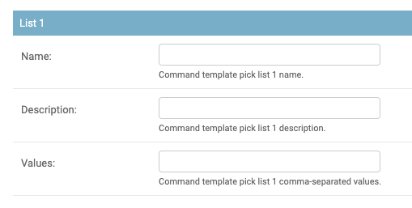

.. image:: ../_static/openl2m_logo.png

=================
Command Templates
=================

Command Templates allow you to administratively define commands with variables in them. These variables can be filled in
by users using a form presented to them in the switch view. This gives tremendous flexibility in giving users in a
controlled fashion more visibililty into the device.

Command Template Configuration
------------------------------

The top series of fields are the template name, and OS, to allow easier displaying when selecting a template.

The description will be shown as a hover-over text over the name.

The Command Template is the special sauce. Here you can use up to 8 freely definable input fields, and up to 4 pick lists, ie lists
where you can preconfigure the selectable values.

You can reference these fields by enclosing them in double curlies, ie between {{ and }}

This is best explain with some examples:

A template where the user can show an Access Control List of their desire, the template would be:

show acl {{field1}}

A template where the user can show ACL out of a list would be configured as follows:

First, define List 1 as eg. "1001, 1002, 1003"
Then define the template as

show acl {{list1}}

**Regular Expressions**

The Regex value for a field, if set, configures a regular expression that the input data for this field will need to match.
If no match, running of the command template will be denied and an error shown to the user.

This uses Python 3 regular expression syntax, as defined at doc:`https://docs.python.org/3/library/re.html#regular-expression-syntax <https://docs.python.org/3/library/re.html#regular-expression-syntax>`

You likely want to explicitly match the start and end of the input, by using the ^ (caret) and $ (dollar sign) characters at start and finish.

Here are are matching pattern examples:

any single word:   ^\w*$

IPv4 address:  ^\d+\.\d+\.\d+\.\d+$

IPv4 subnet in cider notation:  ^\d+\.\d+\.\d+\.\d+\/\d+$

Simple IPv6 network:  ^[\w\d\:]*\/\d+$

Ethernet address in colon notation: ^[0-9a-fA-F]{2}:[0-9a-fA-F]{2}:[0-9a-fA-F]{2}:[0-9a-fA-F]{2}:[0-9a-fA-F]{2}:[0-9a-fA-F]{2}$

Ethernet address in hyphen notation: ^[0-9a-fA-F]{2}\-[0-9a-fA-F]{2}\-[0-9a-fA-F]{2}\-[0-9a-fA-F]{2}-\[0-9a-fA-F]{2}-\[0-9a-fA-F]{2}$

Ethernet address in Cisco dot notation: ^[0-9a-fA-F]{4}\.[0-9a-fA-F]{4}\.[0-9a-fA-F]{4}$

Using Command Templates
-----------------------

Once a command template has been defined, you can assign it to any Switch object you like.
Go to the proper Switch admin page, and simple select the command template from the list.
