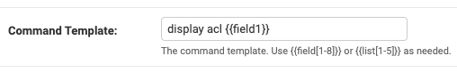
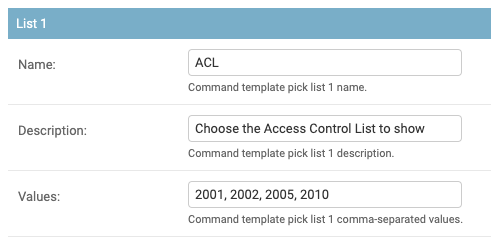
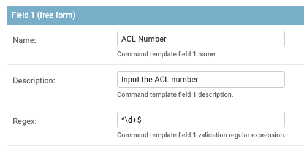
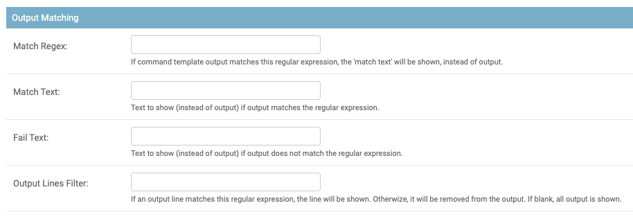

.. image:: ../_static/openl2m_logo.png

=================
Command Templates
=================

Command Templates allow you to administratively define commands with variables in them. These variables can be filled in
by users using a form presented to them in the switch view. This gives tremendous flexibility in giving users in a
controlled fashion more visibility into the device.

Command Template Configuration
------------------------------

The top series of fields are the template name, and OS. The latter field is only to allow easier displaying when selecting
a template in the switch administration form; it is not shown to the user!

.. image:: ../_static/command-template-admin.png

The description will be shown as a hover-over text over the name.

The Command Template is the special sauce. Here you can use up to 8 freely definable input fields, and up to 5 pick lists, i.e lists
where you can pre-configure the selectable values.

You can reference these fields by enclosing them in double curly brackets, i.e. between {{ and }}

.. image:: ../_static/command-template-admin-field.png

.. image:: ../_static/command-template-admin-list.png

This is best explain with some examples:

A template where the user can display an Access Control List of their desire, the command template could be:

display acl {{field1}}

A template where the user can choose the ACL number from a pre-configured list would be defined as follows:

First, define List 1 as eg. "1001, 1002, 1003"

Then define the template as

show acl {{list1}}

**Regular Expressions To Match Fields**

The Regex value for a field, if set, configures a regular expression that the input data for this field will need to match.
If no match, running of the command template will be denied and an error shown to the user.

This uses Python 3 regular expression syntax, and the re.match() function, as defined at doc:`https://docs.python.org/3/library/re.html#regular-expression-syntax <https://docs.python.org/3/library/re.html#regular-expression-syntax>`

You likely want to explicitly match the start and end of the input, by using the ^ (caret) and $ (dollar sign) characters at start and finish.

Here are some matching pattern examples:

any single word:   ^\\w*$

any number: ^\\d+$

IPv4 address or netmask:  ^\\d+\\.\\d+\\.\\d+\\.\\d+$

IPv4 subnet in cider notation:  ^\\d+\\.\\d+\\.\\d+\\.\\d+\\/\\d+$

Simple IPv6 network:  ^[\\w\\d\:]*\\/\\d+$

Ethernet address in colon notation: ^[0-9a-fA-F]{2}:[0-9a-fA-F]{2}:[0-9a-fA-F]{2}:[0-9a-fA-F]{2}:[0-9a-fA-F]{2}:[0-9a-fA-F]{2}$

Ethernet address in hyphen notation: ^[0-9a-fA-F]{2}\\-[0-9a-fA-F]{2}\\-[0-9a-fA-F]{2}\\-[0-9a-fA-F]{2}-\\[0-9a-fA-F]{2}-\\[0-9a-fA-F]{2}$

Ethernet address in Cisco dot notation: ^[0-9a-fA-F]{4}\\.[0-9a-fA-F]{4}\\.[0-9a-fA-F]{4}$

**Simplifying output**

Sometime you want to show a 'status' to the user, depending on the output of the command. Eg. for a firewall rule, you may
want to show 'Allowed' or 'Denied', instead of the full command output.

If you set the Match RegEx field is set, the output will be searched for this regular expression. If it is found,
instead of the command output, the value of the Match Text field is shown. If it is not found, the Fail Text is shown.

If you set the Output Lines Filter regular expression, in addition to the above output, the command output lines that
match this regular expression are added to the output.

Here is a table explaining what is shown depending on settings:

.. list-table:: Command Output
   :widths: 25 25 50
   :header-rows: 1

   * - Match Regex value
     - Output Filter value
     - Output Shown
   * - Not defined
     - Not defined
     - Normal command output
   * - Defined, but NOT matching output
     - Not defined
     - Value of 'Fail Text" shown
   * - Defined, and matching output
     - Not defined
     - Value of 'Match Text" shown
   * - Not defined
     - Defined
     - Only the output lines matching the filter
   * - Defined, but NOT matching output
     - Defined
     - Value of 'Fail Text" shown, followed by output lines matching the filter
   * - Defined, and matching output
     - Defined
     - Value of 'Match Text" shown, followed by output lines matching the filter

Using Command Templates
-----------------------

Once a command template has been defined, you can assign it to any Switch object you like.
Go to the proper Switch admin page, and simple select the command template from the list.
