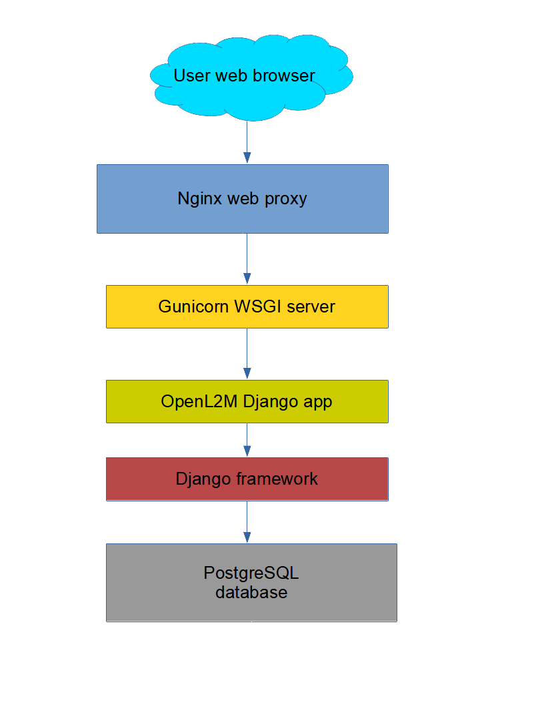

.. image:: ../_static/openl2m_logo.png

============
Installation
============

**Requirements**

OpenL2M has some requirements:

* Python 3.6 or 3.7 (Higher may work, but we only test with v3.6 and 3.7)
* net-snmp v5.7 or greater, including net-snmp-devel
* the Python "easysnmp" package v0.2.5 or greater.
* a web server, with the WSGI capability. We use Nginx in all our documentation.
  Apache may work but is not tested.
* a PostgreSQL database, running at least version 9.6. We use v9.6 and v10.15 in our testing.
* the Django framework, v3.1 or greater. v3.1 is used in testing.

**Application Stack Overview**

Once installation is complete, you will have the following application stack
to get a working OpenL2M application:

* Nginx web server
* Gunicorn WSGI Process with Python
* Postgresql database

At the end of this page is an image showing the application stack.

**Installation**

OpenL2M is developed and tested in a CentOS Linux v7 and v8 environment.
All instructions are related to that.
However, this should work just fine on Ubuntu and other distributions.

.. toctree::
   :maxdepth: 1
   :caption: These are the steps to install OpenL2M on CentOS 7&8:

   database.rst
   openl2m.rst
   nginx.rst
   nginx-ssl.rst
   tasks.rst
   ldap.rst
   upgrading.rst
   alt-python.rst

** Application Stack Overview **

