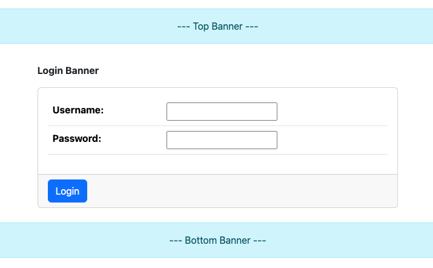
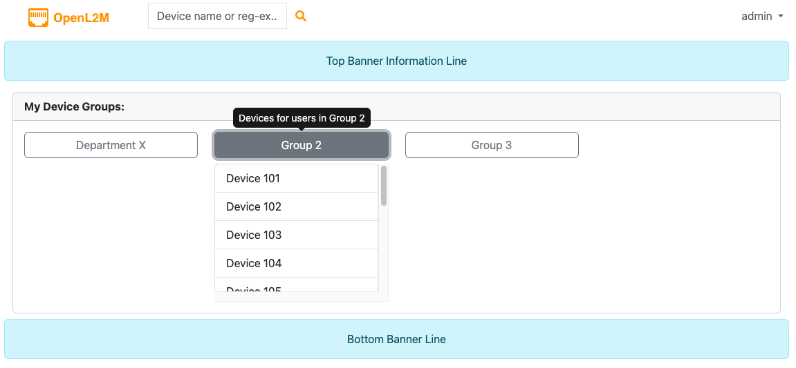
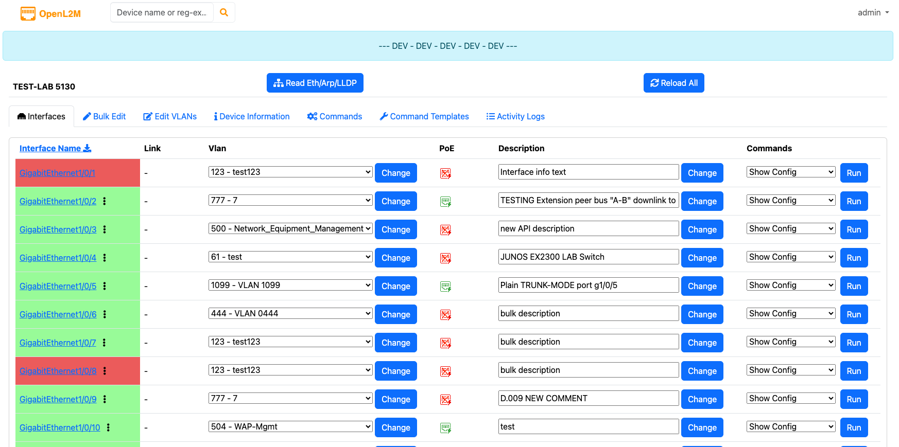
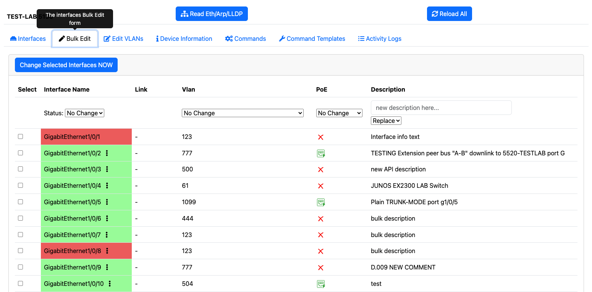
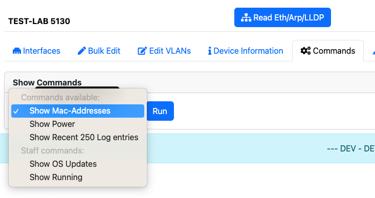
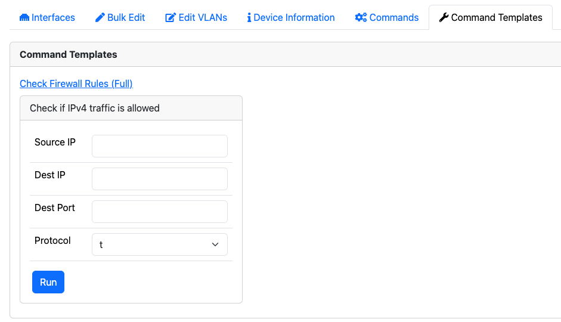

.. image:: _static/openl2m_logo.png

===================
OpenL2M Screenshots
===================

* **Login Window:** Can show configurable login, top, and bottom banners.

* **Devices Menu:** Shows the groups and devices you can access

* **Interfaces Menu:** Edit a single interface at a time

* **Bulk-Edit Menu:** Edit multiple interfaces at once

* **Commands Menu:** Run pre-defined commands on the device

* **Command Templates Menu:** Run pre-defined commands with user-input on the device

* **VLAN Edit Menu:** Add, Rename, or Delete vlans

.. image:: _static/vlan-edit.png
