.. image:: ../_static/openl2m_logo.png

==============
The Basic view
==============

Initially when you click on a switch, the SNMP protocol will be used to read all sorts of data from the switch.
This can take a while; on stacked switches we have seen this take 30-45 seconds for a 5 or 6 member stack.
Please be patient!

Once data has been retrieved, the basic view will open up, with the following elements.

**The top banner**

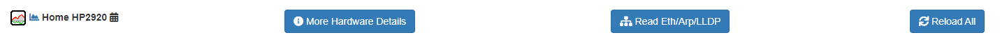

This bar shows the switch name on the left. This may be preceded by one or more icons (configurable by the admin),
which would be links to external systems with more information about the device. E.g. you may see a link to the
Network Management System.

There may be an icon to the left of switch name as well: |tasks| This means there scheduled tasks defined for this switch.
Details can be found in the Information tab.

The entry in the center, :doc:`'Read Eth/Arp/Lldp' <details_view>`, will get you a real-time read of the ethernet
tables (MAC address) and LLPD neighbors of the switch. If the device is a router, ARP for IPv4 will also be shown.

On the right, *'Reload All'*, does exactly that! This forces a complete refresh of all switch data via SNMP.

The *'More Hardware Details'* option adds a few more bits of information to the Information tab below (depending on vendor).

|save_warning|  If you have made changes that require saving the config, an additional option to save the config
will appear on the right with a warning icon in front! Click it to save the running config to the switch startup config.
(I.e. this is a 'write mem'!) When completed, that option will disappear.

.. |save_warning| image:: ../_static/warning-24.png

**The tabs**

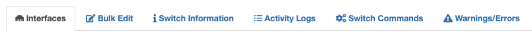

Below the bar are the tabs. The default tab is the **Interfaces** tab,
containing the visible interfaces on the switch. If you have the ability to
manage any of the interfaces, they will be listed with the proper forms
to allow changing the configuration.

Additionally, you will see tabs with switch **Information**, and OpenL2M
**Activity** logs for this switch. If configured, there may even be a tab
for switch **Show commands**.

Interfaces tab
--------------

|interfaces_tab|

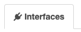

In the Interfaces tab, the following fields are shown:

* **Name**

If the interface is enabled, the name will show on a green background.
If Link is UP, it will be brighter green, if link is DOWN, a somewhat lighter
green color. If the interface is disabled, the background will be red!
(Note these are the default colors. They are admin-configurable, so your mileage may vary!)

Note that the interface name can be preceded by one or more images.
If so, these are links to external systems, such as your Network Management
System. This is configured by the admin.

Interface names can also have several icons behind them. They are:

|trunk|  This means the interface is in trunking or 802.1Q tagged mode.
Hovering over the icon will show the tagged Vlans on this port.

.. |trunk| image:: ../_static/trunk-24.png

|lacp|  This means the interface is an LACP interface, or a member of an LACP aggregation interface.
Hovering over the icon will show the member interfaces if this is a virtual aggregate interface, or on a physical interface it will show which aggregate it is part of.

.. |lacp| image:: ../_static/lacp.png

|voicevlan|  This means the interface has a voice vlan defined on it. This is Cisco
specific. Hovering over the icon will
show the Voice Vlan.

**Enabling or Disabling the Interface**

|disable_interface| If you want to Disable a currently enabled interface, click on the interface name on the left side.
In the warning box, select OK. To enable a disabled port, do the same!

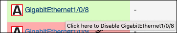

* **Link**

If the interface is enabled, and link established, this will show the link speed in Mbps. A dash indicates no link.

* **Vlan**

The current 'PVID' or 'untagged' vlan of the port will be shown.

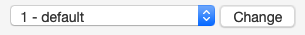

Click the drop-down arrow next to the current untagged vlan, and select the
new untagged vlan. You will only see vlans you are allowed to change to.
Click the 'Change' button to apply the new untagged vlan. Note this may take a
little while, so please be patient.

In some cases, the interface is on a VLAN that is not defined on the switch
(due to backend configurations; this should not happen in properly configured switches!)
In that case, this will show as "<vlan id> - Not Defined"

* **PoE**

If Power-over-Ethernet is enabled on capable switches,
the interface PoE status will be indicated in this field. The power drawn will also be listed,
If we can read it from the switch. An example of the PoE display of enabled
port serving about 9 Watts of power is:

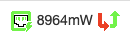

Here are the meanings of the various icons used in the PoE section:

|poe_enabled| This means PoE is enabled, but not serving power.

.. |poe_enabled| image:: ../_static/poe-enabled-24.png

|poe_serving| This means PoE is serving power. Depending on vendor, we can also show
the power consumed by the device on this port.

|poe_fault| This means PoE is enabled, and there is a fault on the port.

|poe_disabled| This means PoE is disabled on this port.

To change state, simply click on the Disabled or Enabled icon to change the power state of the port.

|poe_toggle| Click this icon to toggle the power off,
and then on again after a short wait (5 seconds by default, but admin configurable)
Note this only shows for port with power enabled.

* **Description**

This is the current interface description. If you are allowed to change the description,
type in the new text, and hit 'Change'.

* **Commands**

If defined by the admin, there will be a list of 'show' commands you can issue **for this interface**.

|commands|  Select the command, and click on 'Run Command'. Be patient, and the page will refresh will all current data,
but with a new active 'Command Output' tab showing the results of the command. Continue navigating as usual.

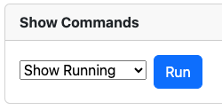

Bulk Edit tab
-------------

|bulkedit_tab|

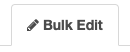

If permissions allow, users will see the Bulk Edit tab. This shows the Bulk Edit form.
This form allows you to apply or schedule (if permitted) a variety of changes at once
to a number of switch interfaces.

This form has two submit buttons, one to apply the changes now,
and if enabled and permitted by your administrator, another to schedule
the changes as a task at a later time.
**Note:** this option will only show if all the back-end processes for task scheduling are running.

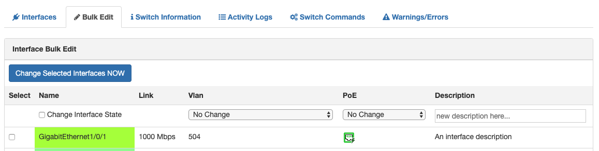

* You can toggle the interface up/down state (a admin-down interface will be brought up, and vice versa,
  an up interface will go admin-down, all at once!)
* You can change the interface (untagged) vlan, and also the interface description.
* You can choose to either change the PoE state (PoE Enabled to Disabled, and PoE Disabled to Enabled),
  or on interfaces with power enabled, 'toggle' power down, and back up (with an admin configurable wait time)
  Note this is done serially, so if you perform this on many interfaces at once, it will take some time!
  Please be patient!

Fill in the form, then select the interfaces you want to apply this to.

**To apply the change now**, click the "Update Selected Interfaces NOW" button,
and your changes will be applied. Please be patient!

**To schedule a task to apply these changes at a later time**, you need to fill in
two additional fields:

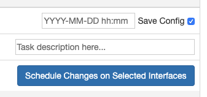

* pick the proposed time the task will run. This is in your local time zone, in 5 minute increments. You can schedule up to 28 days (4 weeks) in advance.
* fill in a short description of the task.

Then click the "Schedule Changes on Selected Interfaces" button.

**Note**
 The requested time is a "no-sooner-then" time. Depending on server load,
 the task may start a short time after the requested date and time.
 Upon completion of the task, the user will be sent an email with the results
 (if their email address is listed in their profile).

Tasks can be seen from the "Information" tab by any user that has access to the switch.
Additionally, users can see all tasks they have scheduled from the main menu, under "Scheduled Tasks".

Switch Information tab
----------------------

|switch_information_tab|

This shows a series of information about the switch. Depending on the device and what is supported via SNMP,
this can include items such as model, firmware, vlans defined on switch, PoE power supply info, stacking info,
IP(v4) addresses of the switch, and more.

If there are scheduled tasks for the selected switch, they will also be shown here.
Any user with the ability to create tasks, can delete scheduled tasks from this tab. (Assuming the background processes are running!)

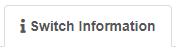

Activity Logs tab
-----------------

|activity_logs_tab|

This will show the last OpenL2M activity on this switch. I.e. anything changed will be listed here
by user and time.

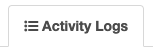

Show Commands tab
-----------------

|commands_tab|
This tab will only show if 'global' switch-level commands are configured by the admin.

This tab will give a simple form with some 'global' show commands you can execute on the switch.
Select a command, click on 'Run Command', and be patient! When complete, the page will refresh and a new 'Command Output'
tab will be added.

Warnings/Errors tab
-------------------

|warnings_errors_tab|
This tab will only show if warnings or errors were found at some point.

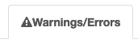

|warnings|
The content of this tab will show a variety of warnings and non-critical errors discovered.

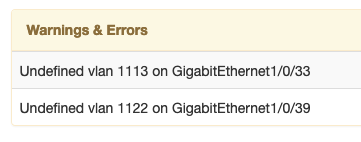
