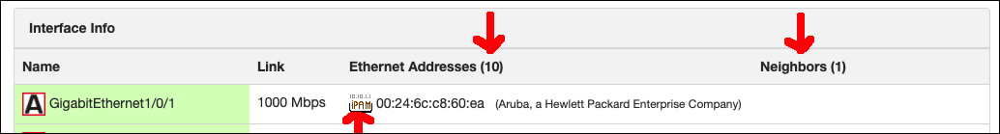

.. image:: ../_static/openl2m_logo.png

=====================
the Eth/ARP/LLDP view
=====================

When you click the 'Read Eth/Arl/Lldp' link in the menu bar in the Basic view,
after being patient, the details of the switch connections will be shown in
the "Eth/ARP/LLDP" tab. This is 'real-time' data! To reload and update this
data, simply click the 'Refresh Details' link!

The details include the 'known ethernet address' table, the LLDP neighbor table, and if the device is a router,
any known IPv4 ARP entries. If this is regular switch, the ARP entries will likely only be for the default gateway!

Note the three areas highlighted in the above image. The first is a configurable link to an
IP Address Management (IPAM) system that would link you to the found ethernet address in your IPAM.

The second arrow indicates the number of known ethernet addresses on this
switch; here that is 10.

The third, right-most arrow indicates the number of LLDP neighbors heard,
here that is 1. The neighbors are listed in the row of the interface where
they are connected. You may have to scroll down to see this data.

**The following fields are shown:**

**Name** and **Link** are the same as on the Basic view.

**Ethernet Addresses**

MAC addresses are shown on the interface where they are heard. If known,
the vendor OUI (first 3 bytes of the address) is listed. See the comment
above about configurable icons in front of the ethernet address.

If the device happens to have an ARP table (e.g. on a router),
the ethernet addresses that also have a known IP address will be shown with
their IP v4 address. The admin can also add configurable icons in front of the
IP v4 address, for links to e.g. IPAM (see above.)

**Neighbors**

LLDP neighbors will be shown on the interface they are heard on. Depending on what is advertised, the icon may
indicate the type of device. E.g. Routers, Phones, Access Points, etc. You can hover over the icon to see what
type of device is advertised.

.. image:: ../_static/lldp-info-router.png

Devices may send a name and chassis info. If so, this will show. Some send IP address as chassis info,
others send their ethernet address, and yet others send nothing at all. If the device sends a description,
that will show as a hover-over text.
