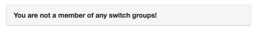
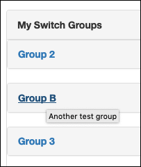
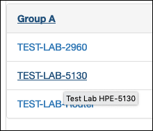

.. image:: ../_static/openl2m_logo.png

====================
Login and Navigation
====================

After login, you get a list of switch groups. If you see no groups, please contact your administrator.

If you have just one group, it will list all switches in that group.

.. image:: ../_static/one-group.png

If you have multiple groups, they are listed as collapsed choices.

Hover over the group to see a description of that group (if defined by your admin). Click on the group
to see the switches contained in it.

If you hover your mouse over a switch, you see a description (if defined by your admin)
Click on a switch to manage that device. Note that **all data** is read **live** from the switch via SNMP,
so this make take a little bit. After a little bit of patience, this will bring you to the
:doc:`the Basic Switch View <basic_view>`, showing all (visible) interfaces of the device.

To return to the top menu at any time, click the image in the top left

.. image:: ../_static/top-menu.png
