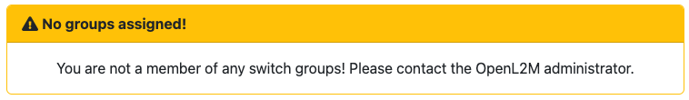
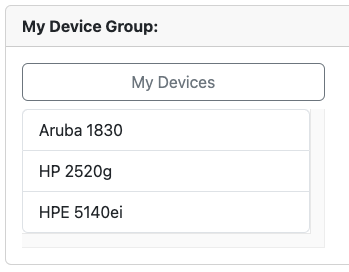
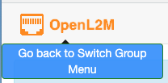

.. image:: ../_static/openl2m_logo.png

====================
Login and Navigation
====================

Nearly every element of the OpenL2M web page has a tooltip associated with it. If you are curious what a button
or field is about, move you mouse to it and read the tooltip that will pop up.

Login
-----

After login, you get a list of device groups. If you see no groups, please contact your administrator.

If you have just one group, it will list all devices in that group.

If enabled by your administrator, you will see a search box before the list of device groups.
You can use pattern matching or regular expressions to quickly find a device among the groups.

If you have multiple groups, they are listed as collapsed choices.
Hover over the group to see a description of that group (if defined by your admin).

Click on the group to see the devices contained in it.
If you hover your mouse over a device, you see a description (if defined by your admin)

.. image:: ../_static/devices-menu.png

Click on a device to access it. Note that **all data** is read **live** from the device!
After a little bit of patience, this will bring you to the
:doc:`Basic Device View <basic_view>`, showing all (visible) interfaces of the device.

To return to the top menu at any time, click the image in the top left.
This will also apply any changed device group permissions.
I.e. no need to logout and login again.

