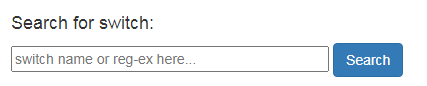

.. image:: ../_static/openl2m_logo.png

====================
Login and Navigation
====================

Nearly every element of the OpenL2M web page has a tooltip associated with it. If you are curious what a button
or field is about, move you mouse to it and read the tooltip that will pop up.

Login
-----

After login, you get a list of switch groups. If you see no groups, please contact your administrator.

.. image:: ../_static/no-groups.png

If you have just one group, it will list all switches in that group.

.. image:: ../_static/one-group.png

If enabled by your administrator, you will see a search box before the list of switch groups.
You can use pattern matching or regular expressions to quickly find a switch among the groups.

If you have multiple groups, they are listed as collapsed choices.
Hover over the group to see a description of that group (if defined by your admin).

.. image:: ../_static/groups.png

Click on the group to see the switches contained in it.
If you hover your mouse over a switch, you see a description (if defined by your admin)

.. image:: ../_static/group-expanded.png

Click on a switch to manage that device. Note that **all data** is read **live** from the switch via SNMP,
so this make take a little bit. After a little bit of patience, this will bring you to the
:doc:`the Basic Switch View <basic_view>`, showing all (visible) interfaces of the device.

To return to the top menu at any time, click the image in the top left.
This will also apply any changed switch group permissions.
I.e. no need to logout and login again.

.. image:: ../_static/top-menu.png
